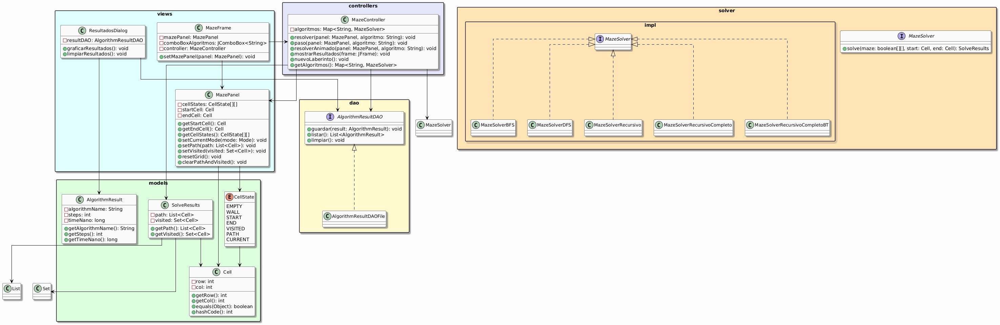
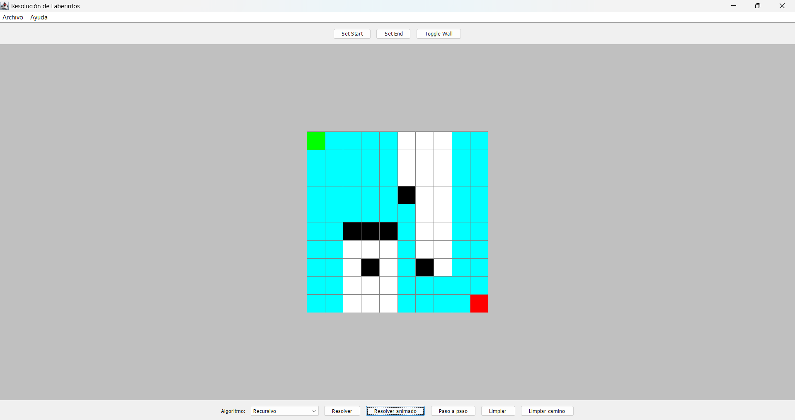
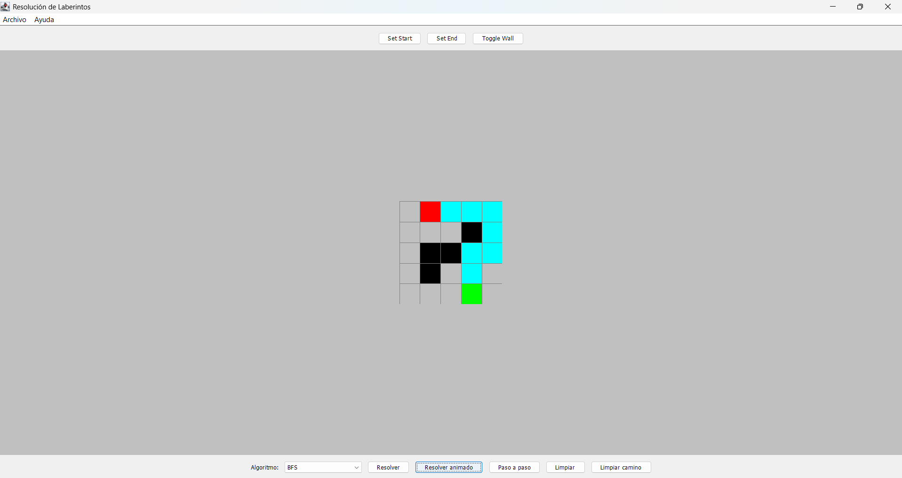

# Universidad Politécnica Salesiana
**Facultad de Ingeniería**  
**Carrera de Ingeniería en Computación**

---

## Materia: Estructura de Datos
**Título del proyecto:** Proyecto Final  
**Fecha de entrega:** 28 de julio de 2025  
**Profesor:** Ing. Pablo Torres

---

## Autores
- Erick Yunga
    - Correo institucional: eyungac3@est.ups.edu.ec
- Brandon Rivera
    - Correo institucional: briveraz@est.ups.edu.ec
- Github
    - https://github.com/BrandonFRZ-cki/icc-est-ProyectoFinal
---
# Descripción del problema
### Se requiere desarrollar una aplicación de escritorio en Java que permita la resolución visual de laberintos mediante diferentes algoritmos de búsqueda. La aplicación debe permitir al usuario establecer el tamaño del laberinto, seleccionar el punto de inicio, final y obstáculos, y posteriormente ejecutar uno de los algoritmos para visualizar su funcionamiento, identificando los caminos explorados y el camino final encontrado, si existe.

---

#  Propuesta de solución
## Marco teórico
### Algoritmos implementados:

* Recursivo: Algoritmo sencillo que explora en profundidad hasta encontrar una solución, sin garantizar el camino más corto.

* Recursivo Completo: Asegura que todas las rutas posibles se exploren hasta encontrar una solución, si existe.

* Recursivo Completo con Backtracking: Variante que explora todos los caminos posibles y retrocede inteligentemente cuando encuentra bloqueos.

* DFS (Depth-First Search): Búsqueda en profundidad. Explora lo más lejos posible en una dirección antes de retroceder. Eficiente pero no garantiza el camino más corto.

* BFS (Breadth-First Search): Búsqueda por anchura. Explora por niveles, garantizando siempre el camino más corto. Requiere más memoria que DFS.

---

# Tecnologías utilizadas
* Lenguaje de programación: Java 17
* Interfaz gráfica: Java Swing
* Arquitectura: MVC (Modelo-Vista-Controlador) y DAO
* Persistencia de datos: Archivos .csv
* IDE usado: IntelliJ IDEA
* Control de versiones: Git y GitHub

---

#  Diagrama UML
## Ejemplo 1: Laberinto de 10x10 usando el algoritmo Recursivo

---

# Captura

### Descripción del ejemplo:

* Se ha generado un laberinto de tamaño 10 filas x 10 columnas.

* El usuario ha seleccionado el punto de inicio (celda verde en la esquina superior izquierda) y el punto de fin (celda roja en la esquina inferior derecha).

* Las celdas negras representan muros u obstáculos.

* Las celdas celestes indican el camino recorrido por el algoritmo recursivo hasta encontrar la solución.

### Funcionamiento del algoritmo:

* El algoritmo recursivo explora de manera profunda, es decir, sigue una dirección hasta llegar a un límite o bloqueo, y luego retrocede (backtracking) para intentar nuevas rutas.

* En este caso, logró llegar al destino realizando varias bifurcaciones, ya que no siempre elige el camino más corto.

* Es útil en laberintos donde encontrar cualquier solución (aunque no sea óptima) es suficiente.

## Ejemplo 2: Laberinto de 5x5 usando el algoritmo BFS (Breadth-First Search)

### Descripción del ejemplo:

* Se trabajó con un laberinto pequeño de 5 filas x 5 columnas.

* El inicio se encuentra en la esquina inferior derecha (verde) y el fin en la esquina superior izquierda (rojo).

* Los muros (negros) forman un obstáculo central.

* Las celdas celestes marcan el camino recorrido por BFS.

### Funcionamiento del algoritmo:

* BFS (Breadth-First Search) trabaja por niveles de profundidad creciente, explorando primero las celdas más cercanas al inicio antes de alejarse.

* Este comportamiento le permite garantizar el camino más corto hacia el objetivo, si existe.

* En este ejemplo, BFS encontró una solución óptima y directa a pesar de los obstáculos intermedios.

* Es especialmente útil en problemas donde la eficiencia y minimización del recorrido son importantes (como robótica, evacuaciones, GPS, etc.).

---

# Código ejemplo del algoritmo: BFS (Breadth-First Search)

* El algoritmo BFS recorre el laberinto nivel por nivel. Utiliza una cola (FIFO) para visitar los vecinos y siempre garantiza el camino más corto si existe.

        @Override
        public SolveResults solve(boolean[][] maze, Cell start, Cell end) {
        Queue<Cell> queue = new LinkedList<>();          // Cola para recorrido BFS
        Map<Cell, Cell> parentMap = new HashMap<>();     // Mapa para reconstruir el camino final
        Set<Cell> visited = new LinkedHashSet<>();       // Celdas ya visitadas

        queue.offer(start);   // Agregamos la celda inicial a la cola
        visited.add(start);   // Marcamos como visitada

        boolean found = false;

        // Mientras haya celdas por explorar
        while (!queue.isEmpty()) {
        Cell current = queue.poll(); // Extraemos la siguiente celda
        if (current.equals(end)) {   // Si llegamos al final, terminamos
            found = true;
            break;
        }

        // Explorar vecinos válidos (N, S, E, O)
        for (Cell neighbor : getNeighbors(current, maze)) {
            if (!visited.contains(neighbor)) {
                queue.offer(neighbor);                  // Lo añadimos a la cola
                visited.add(neighbor);                  // Lo marcamos como visitado
                parentMap.put(neighbor, current);       // Guardamos quién lo visitó
            }
        }
        }

        // Si encontramos el final, reconstruimos el camino
        List<Cell> path = found ? buildPath(end, parentMap) : Collections.emptyList();
        return new SolveResults(path, visited);}

* Función auxiliar para reconstruir el camino desde el final al inicio:

      private List<Cell> buildPath(Cell end, Map<Cell, Cell> parentMap) {
      List<Cell> path = new ArrayList<>();
      for (Cell at = end; at != null; at = parentMap.get(at)) {
      path.add(at);
      }
      Collections.reverse(path); // Lo invertimos para ir del inicio al fin
      return path;
      }
* Función para obtener vecinos válidos:

    private List<Cell> getNeighbors(Cell cell, boolean[][] maze) {
    List<Cell> neighbors = new ArrayList<>();
    int r = cell.getRow();
    int c = cell.getCol();
    int[][] dirs = {{-1, 0}, {1, 0}, {0, -1}, {0, 1}}; // N, S, O, E

    for (int[] d : dirs) {
        int nr = r + d[0], nc = c + d[1];
        // Verificamos que esté dentro del laberinto y no sea un muro
        if (nr >= 0 && nr < maze.length && nc >= 0 && nc < maze[0].length && maze[nr][nc]) {
            neighbors.add(new Cell(nr, nc));
        }
    }
    return neighbors;
    }

---

# Conclusiones
## Erick Yunga
- #### Desde mi experiencia desarrollando y probando los distintos algoritmos de resolución de laberintos, considero que el algoritmo BFS (Breadth-First Search) es el más óptimo en términos de calidad de solución, ya que siempre encuentra el camino más corto si existe, lo cual es esencial en contextos donde la eficiencia del recorrido es crítica, como en navegación de robots o rutas de evacuación.

- #### Sin embargo, reconozco que su desventaja es el alto uso de memoria, especialmente en laberintos grandes. Aun así, en la mayoría de los casos prácticos, su precisión y confiabilidad justifican su elección.

## Brandon Rivera
- #### Después de implementar y observar el comportamiento de todos los algoritmos, considero que el algoritmo DFS (Depth-First Search) es el más práctico y eficiente para laberintos pequeños o con pocos obstáculos. Su ventaja principal es el bajo uso de memoria, ya que no necesita almacenar todos los caminos posibles, lo que lo vuelve ideal para sistemas con recursos limitados.

- #### No obstante, hay que tener en cuenta que no garantiza el camino más corto, por lo que su uso debe limitarse a contextos donde lo importante sea encontrar una salida, no necesariamente la más corta.

---

# Recomendaciones y aplicaciones futuras
### Recomendaciones:
* Modularizar mejor el código para permitir añadir más algoritmos con facilidad, como A*, Dijkstra o Greedy.

* Incluir pruebas automatizadas para validar la correcta ejecución de cada algoritmo en distintos tipos de laberintos.

* Mejorar la interfaz gráfica, agregando animaciones más suaves, colores personalizables y mensajes en tiempo real que expliquen el estado actual del algoritmo.

* Permitir cargar laberintos desde archivos externos, facilitando pruebas con casos más complejos.

* Mostrar estadísticas, como número de nodos visitados, tiempo de ejecución y longitud del camino.

### Aplicaciones futuras:
* Robótica móvil: Para la navegación autónoma de robots en entornos estructurados, donde se necesita encontrar rutas óptimas evitando obstáculos.

* Planificación de rutas en mapas, como en aplicaciones GPS que determinan el mejor camino entre dos puntos.

* Evacuación en emergencias, simulando la salida más rápida de personas desde un edificio durante una catástrofe.

* Didáctica en educación, como herramienta para enseñar algoritmos de búsqueda y estructuras de datos de forma interactiva.

